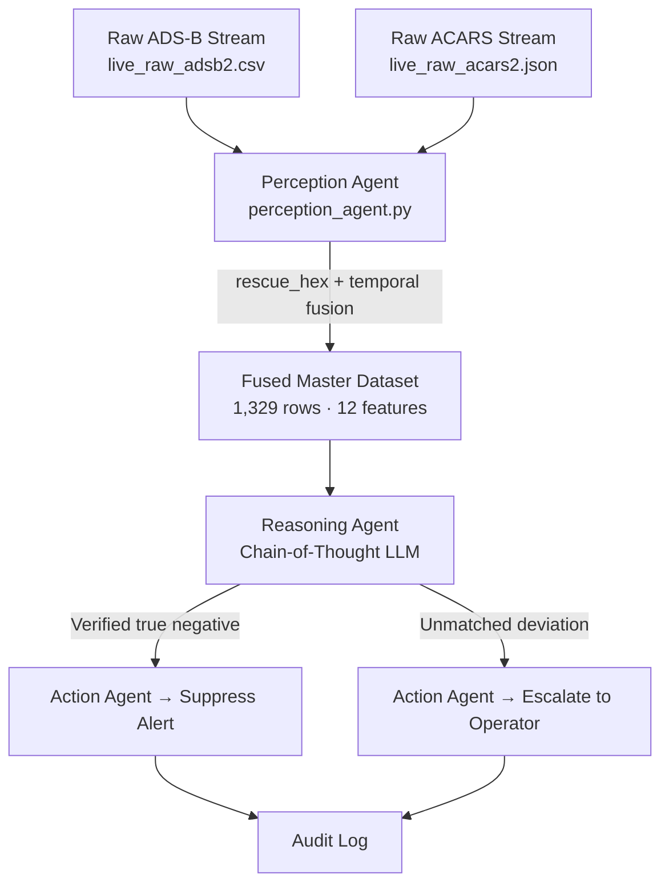

# Cross-Channel ADS-B Intrusion Detection Using ACARS-Assisted Verification via a Multi-Agent Agentic AI Pipeline

> Developed at the **NCRA-UAV Lab (FAST-NUCES, Islamabad)**

---

## 🛰️ Project Overview

Modern commercial aviation tracking suffers from a critical structural vulnerability: the two primary communication and surveillance channels — **ADS-B** and **ACARS** — operate in complete isolation, with no automated cross-channel verification. This gap is actively exploitable by adversaries.

This project introduces a **context-aware, autonomous multi-agent defense pipeline** built on a synchronized **Perception-Reasoning-Action (PRA)** architecture. Rather than evaluating radar paths in a vacuum, our framework automatically locks live telemetry feeds to the text-based operational intentions of the aircraft. A central **Chain-of-Thought (CoT)** reasoning agent separates sophisticated signal spoofing attacks from authorized, approved flight path adjustments — directly tackling the aviation industry's false-positive alarm crisis.

---

## ⚠️ The Problem: Aviation's Blind Spot

The structural disconnection between cockpit data channels presents a highly dangerous and exploitable threat surface:

- **ADS-B Has No Native Security** — The standard 1090 MHz ADS-B data link operates without cryptographic encryption or authentication. Using an affordable Software Defined Radio (SDR) kit, an attacker can broadcast fabricated "ghost plane" tracks or replay recorded flights directly onto air traffic control displays.

- **Existing Detectors are Context-Blind** — State-of-the-art defenses apply standalone anomaly detectors (notably **Isolation Forest**) exclusively to single-channel ADS-B data. They have zero visibility into the aircraft's operational directives. A legitimate altitude change due to an ATC clearance gets flagged as a hostile threat.

- **Operator Alert Fatigue** — High false-positive rates from single-channel models continuously overload human air traffic controllers, making real-time identification of genuine spoofing events slow and error-prone.

---

## 🧠 Proposed Solution: Multi-Agent PRA Framework

Our framework establishes a coordinated, automated defense sequence spanning both data streams through three specialized agents running in a fast pipeline:

### 3.1 Perception Agent (`perception_agent.py`)
The high-speed ingestion and data-synchronization engine. It simultaneously listens to live raw ADS-B telemetry and incoming ACARS datalink text feeds, cleans formatting anomalies, and automatically links separate entries into a unified event record indexed by each aircraft's unique **24-bit ICAO hardware registration address**.

### 3.2 Reasoning Agent — Chain-of-Thought LLM (`reasoning_agent.py`)
The analytical core of the system. Instead of relying on a rigid black-box classifier, the agent evaluates combined flight entries using **Chain-of-Thought (CoT) prompting**. When a telemetry deviation is detected, it:
- Extracts and semantically evaluates the matching ACARS communication block for authorized triggers (e.g., `DESCENT`, `CLIMB`, `ALT`, zone clearance codes)
- Builds a step-by-step internal investigative hypothesis
- Outputs a structured anomaly confidence score with human-readable justifications

### 3.3 Action Agent (`action_agent.py`)
Receives the reasoning agent's verdict and executes the corresponding enforcement protocol:
- **Autonomous Suppression** — Confirmed ACARS-matched deviations are suppressed as verified true negatives
- **Operator Alert Escalation** — Trajectory contradictions with zero matching intent records trigger an emergency alarm with a natural-language evidence brief
- **Audit Logging** — Every decision is written to an immutable log for certification audit compliance

---

## 🔄 System Architecture & Dataflow



---

## 📊 Cross-Stream Data Fusion & Preprocessing

Before the agent pipeline runs, a strict data synchronization stage executes inside `adsb_acars_fusion_preprocessing.ipynb`.

### Ingested Dataset Profiles

| Dataset | Raw Volume | Key Issues |
|---|---|---|
| `live_raw_adsb2.csv` (ADS-B) | 760,138 rows · 8 attributes | 11,453 missing callsigns; 63,247 missing baro altitudes |
| `live_raw_acars2.json` (ACARS) | 1,069 text communications | 517 of 1,069 logs missing primary `fromHex` identifier |

### `rescue_hex` Key Recovery
To recover missing ACARS identifiers, the Perception Agent executes a custom string rescue loop:
1. Forces all hardware text records to standardized lowercase
2. If the main identifier field is blank, parses inner sub-dictionaries of `airframe`, `station`, and `tail` parameters
3. Claims any embedded 6-character hexadecimal string matching standard transponder registrations and writes it back to the primary index

**Result:** 449 out of 517 missing entries recovered — total tracking loss reduced from 517 to only **68 unresolvable lines**.

### Asynchronous Temporal Window Matching
Because radar coordinates and ACARS packets arrive at ground antennas asynchronously:
- All timestamps are cast to raw Unix Epoch floats (`timestamp_adsb_numeric`, `timestamp_acars_numeric`)
- Entries are matched on clean ICAO hardware identifier (`icao24`)
- Rows where `time_delta = |timestamp_adsb - timestamp_acars| > 60 seconds` are filtered out

### Final Production Dataset

| Metric | Value |
|---|---|
| Final fused rows | **1,329 pristine rows** |
| Average sync gap | **29.85 seconds** |
| Feature dimensions | **12 core variables** |

**12-Feature Schema:**
```
['timestamp_adsb_numeric', 'icao24', 'callsign', 'origin_country',
 'latitude_adsb', 'longitude_adsb', 'baro_altitude', 'velocity',
 'tail', 'flightNumber', 'frequency', 'text']
```

---

## 🔬 Research Methodology & Ablation Setup

The project is structured around one primary research objective and four supporting Research Questions:

| RQ | Focus |
|---|---|
| **RQ1** | Feature Discrimination — Which cross-channel variables best separate spoofing from approved corrections? |
| **RQ2** | Ingestion Representation — How must the Perception Agent serialize joint event streams to optimize downstream LLM reasoning? |
| **RQ3** | Reasoning Strategy — Ablation comparing CoT prompting vs. RAG vector retrieval vs. strict rule-based parsers |
| **RQ4** | False-Alarm Thresholds — Under what conditions does autonomous alert suppression minimize workload without increasing missed detections? |

### Literature-Driven Methodological Safeguards

- **SODA Phase-Layer Analysis** — Hardware variations leave un-fakeable prints on signal phases, forming the basis of primary verification checks
- **Kacem Cyber-Physical Bounds** — Flight updates are checked against physics models via 3D safe-zone spheres calculated from real aircraft performance bounds (`physics_verifier.py`)
- **LSTM Sequence Residual Monitoring** — A moving window sequence framework predicts upcoming positions to flag sudden track anomalies

---

## 📁 Repository Structure

```
ADS-B-Agentic-AI-Defense/
├── data/
│   ├── raw/                           # Ingested raw source matrices (csv & json)
│   └── processed/                     # 1,329 fused master rows ready for AI use
├── docs/
│   ├── research/                      # Structured literature breakdown summaries
│   └── proposals/                     # Foundational research guidelines from lab
├── notebooks/
│   └── adsb_acars_fusion_preprocessing.ipynb  # Primary data alignment notebook
├── src/
│   ├── agents/
│   │   ├── perception_agent.py        # Key rescue, filtering, and timestamp syncing
│   │   ├── reasoning_agent.py         # LLM Chain-of-Thought verification engine
│   │   └── action_agent.py            # Alert suppression and enforcement script
│   └── utils/
│       └── physics_verifier.py        # Aerodynamic threshold calculation scripts
├── requirements.txt                   # Software dependency packages
└── README.md                          # Master project documentation file
```

---

## ⚙️ Setup & Installation

```bash
# Clone the repository
git clone https://github.com/your-org/ADS-B-Agentic-AI-Defense.git
cd ADS-B-Agentic-AI-Defense

# Install dependencies
pip install -r requirements.txt
```

---

## 👥 Research & Development Team

**NCRA-UAV Lab, FAST-NUCES, Islamabad**

| Name | Role |
|---|---|
| Abdul Mannan | AI/ML Intern, NCRA-UAV Lab |
| Talha Anwar | AI/ML Intern, NCRA-UAV Lab |

**Supervised By:** 
| Name | Role |
|---|---|
| Duaa Fatima | NCRA-UAV Lab |
| Syeda Mahum Raza | NCRA-UAV Lab |
**Institution:** National Center of Robotics and Automation (NCRA) — UAV Lab, FAST-NUCES, Islamabad
